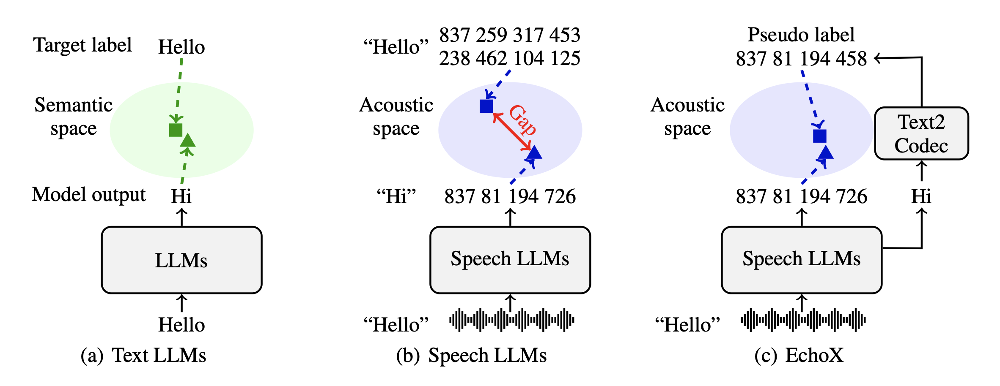

# EchoX: Towards Mitigating Acoustic-Semantic Gap via Echo Training for Speech-to-Speech LLMs

[](#license)
[](#environment-setup)
[](#environment-setup)
[]()

> **EchoX: Towards Mitigating Acoustic-Semantic Gap via Echo Training for Speech-to-Speech LLMs**  
> Yuhao Zhang, Yuhao Du, Zhanchen Dai, et al. — *Under review at ICLR 2026*  
> 📄 [Paper (to be added)](https://arxiv.org/abs/XXXX.XXXX)

---

## Table of Contents
- [EchoX: Towards Mitigating Acoustic-Semantic Gap via Echo Training for Speech-to-Speech LLMs](#echox-towards-mitigating-acoustic-semantic-gap-via-echo-training-for-speech-to-speech-llms)
  - [Table of Contents](#table-of-contents)
  - [Highlights](#highlights)
  - [Method Overview](#method-overview)
  - [Performance](#performance)
  - [Datasets and Models](#datasets-and-models)
    - [Dataset](#dataset)
    - [Model](#model)
  - [Quickstart](#quickstart)
    - [Environment Setup](#environment-setup)
    - [Model Download](#model-download)
    - [Inference](#inference)
  - [Acknowledgments](#acknowledgments)
  - [Citation](#citation)
  - [License](#license)

---

## Highlights



- **Problem**: Current speech-to-speech large language models (SLLMs) suffer from degraded reasoning and knowledge due to the conflicting focus on acoustic learning.
- **Solution**: EchoX integrates both acoustic and semantic learning by dynamically generating speech tokens from semantic representations. This mitigates the degradation problem, preserving the reasoning abilities of LLMs.
- **Impact**: EchoX achieves state-of-the-art performance on knowledge-based question-answering tasks while reducing data requirements to just 10,000 hours of training data.
- **Performance**: EchoX outperforms existing models in various benchmarks, delivering superior performance with a more efficient training setup.

---

## Method Overview


EchoX integrates both semantic and acoustic learning to address the challenges of current speech-to-speech models. We propose a novel three-stage training pipeline:

1. **Stage I: Speech-to-Text (S2T)**: Converts speech to text, enabling the model to capture semantic information from spoken inputs.
2. **Stage II: Text-to-Codec (T2C)**: Transforms text into speech tokens, bridging the gap between text-based LLMs and speech-based representations.
3. **Stage III: Echo Training**: Combines the outputs of S2T and T2C, training the model to generate speech from semantic understanding, preserving the core language model’s intelligence.

The integration of both speech and semantic learning ensures that EchoX can preserve the reasoning abilities of LLMs while improving speech-based tasks.

---

## Performance

<div style="text-align: center;">
  
</div>
<!--  -->
<!--  -->

EchoX has demonstrated exceptional performance in knowledge-based question-answering tasks. The model achieves superior results with minimal training data, setting a new benchmark for efficiency.

---

## Datasets and Models

### Dataset
EchoX is trained on carefully curated datasets for each stage of the pipeline, ensuring optimal performance across S2T, T2C, and S2S tasks. The datasets used are as follows:

| Dataset Type           | Description                                                              | Size                   | Download Link                                      |
| ---------------------- | ------------------------------------------------------------------------ | ---------------------- | -------------------------------------------------- |
| **Speech-to-Text (S2T)** | Multi-turn dialog datasets processed for speech-to-text tasks             | 810 hours              | [Link to S2T Dataset](https://huggingface.co/datasets/FreedomIntelligence/EchoX-Dataset) |
| **Text-to-Codec (T2C)** | Text-to-speech data with paired codec tokens                              | 40 hours               | [Link to T2C Dataset](https://huggingface.co/datasets/FreedomIntelligence/EchoX-Dataset) |
| **Speech-to-Speech (S2S)** | Conversational and reasoning-based speech datasets for generating responses | 150 hours              | [Link to S2S Dataset](https://huggingface.co/datasets/FreedomIntelligence/EchoX-Dataset) |

### Model
The following pre-trained models are available for download:

| Model     | Parameters | Training Data   | Download Link                                      |
| --------- | ---------- | --------------- | -------------------------------------------------- |
| **EchoX-3B** | 3 billion  | 10K hours       | [EchoX-3B Model](https://huggingface.co/FreedomIntelligence/EchoX-3B) |
| **EchoX-8B** | 8 billion  | 10K hours       | [EchoX-8B Model](https://huggingface.co/FreedomIntelligence/EchoX-8B) |

---

## Quickstart

### Environment Setup
To set up your environment, follow these steps:
```bash
git clone https://github.com/FreedomIntelligence/EchoX.git
cd EchoX
conda create -n echox python=3.10 pip=24.0
conda activate echox
pip install -r requirements.txt
```


### Model Download

Download the models with the following command:

```bash
huggingface-cli download --resume-download FreedomIntelligence/EchoX-8B --local-dir EchoX-8B
huggingface-cli download --resume-download openai/whisper-large-v3 --local-dir whisper-large-v3
```

### Inference

Run inference on a test case with the following command:
```bash
python demo.py
```

Or you can start Gradio web page with the following command:
```bash
python app.py
```

You can assign the GPU with the following command:
```bash
CUDA_VISIBLE_DEVICES=1 python app.py
```

---

## Acknowledgments

Special thanks to Hugging Face for providing models, datasets, and space hosting services. You can access [this Hugging Face Space](https://huggingface.co/spaces/FreedomIntelligence/EchoX) to experience our hands-on demo—no installation required, ready to use out of the box.

---

## Citation

If you use EchoX in your research or projects, please cite our paper:

```bibtex
@inproceedings{zhang2026echox,
  title={EchoX: Towards Mitigating Acoustic-Semantic Gap via Echo Training for Speech-to-Speech LLMs},
  author={Zhang, Yuhao and Du, Yuhao and Dai, Zhanchen and others},
  booktitle={Proceedings of ICLR 2026},
  year={2026},
  url={https://arxiv.org/abs/XXXX.XXXX}
}
```

---

## License

This project is licensed under the MIT License. See the [LICENSE](LICENSE) file for details.
